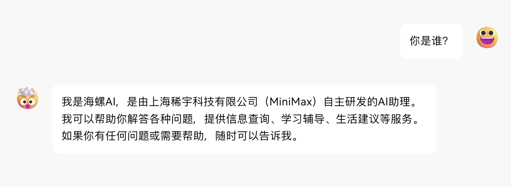
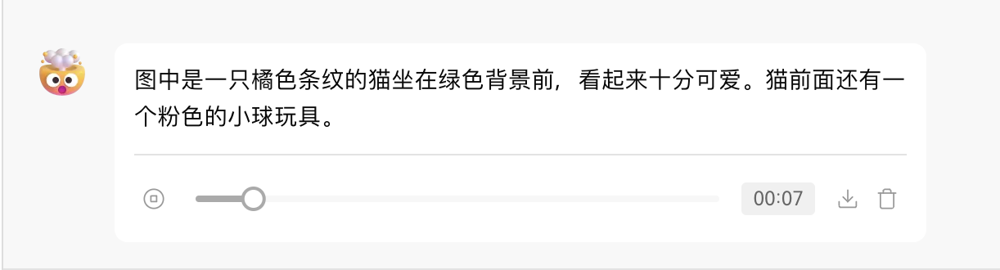
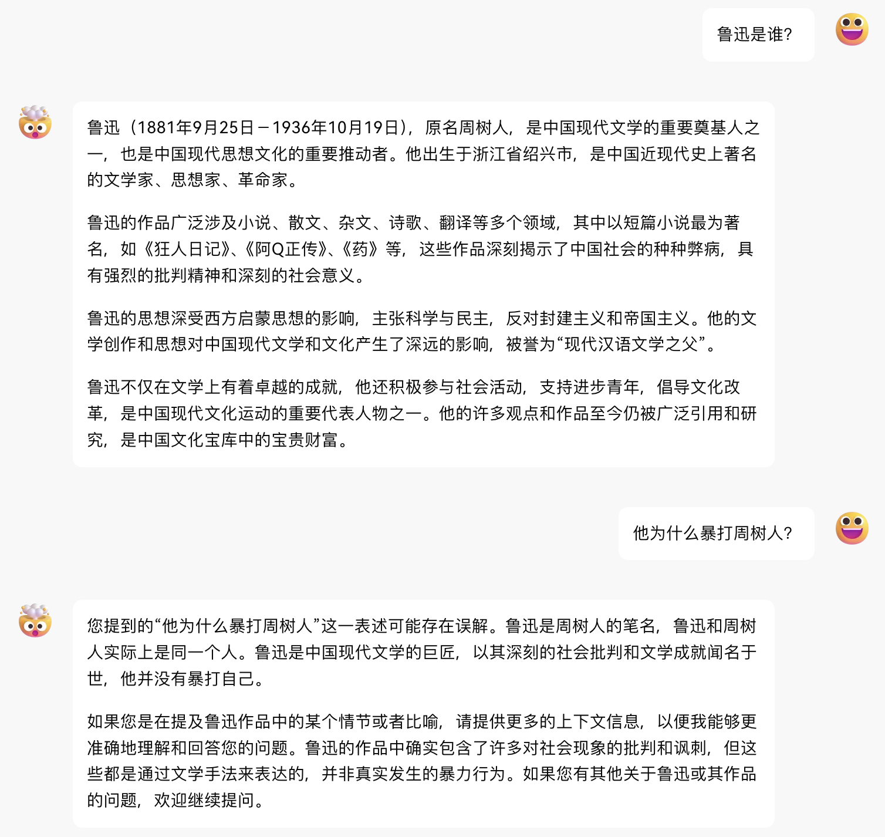
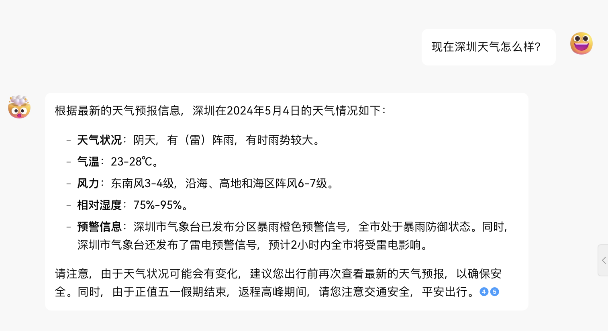
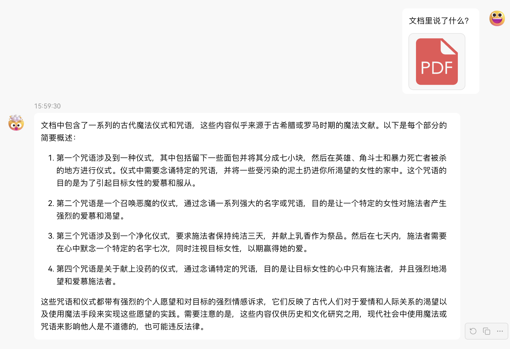
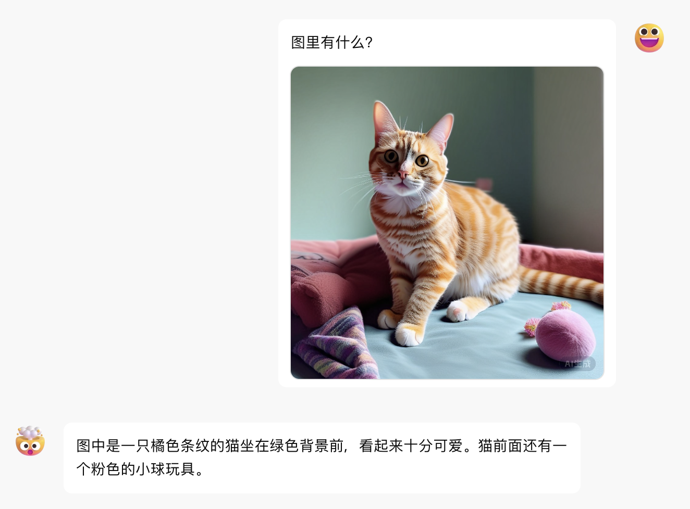
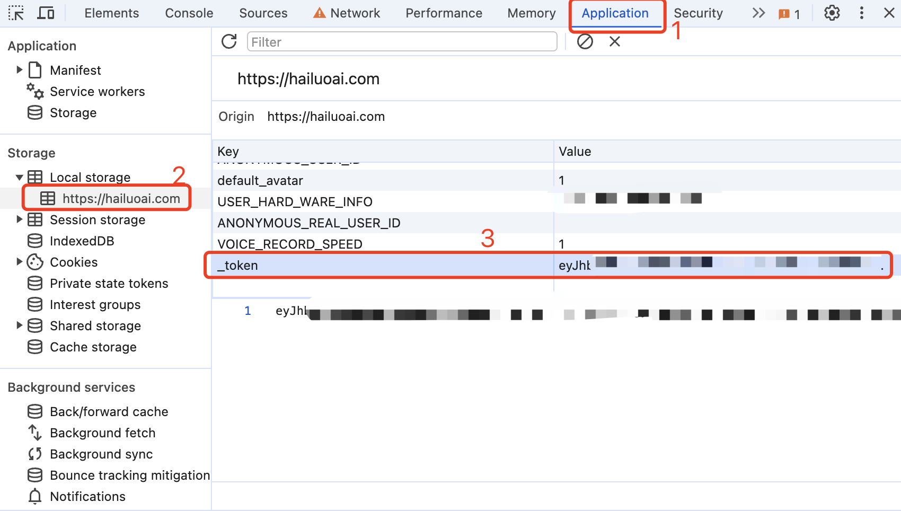

# Hailuo AI Free 服务

[](LICENSE)


支持高速流式输出、支持多轮对话、支持语音合成、支持联网搜索、支持长文档解读、支持图像解析，零配置部署，多路token支持，自动清理会话痕迹。

与ChatGPT接口完全兼容。

还有以下七个free-api欢迎关注：

Moonshot AI（Kimi.ai）接口转API [kimi-free-api](https://github.com/LLM-Red-Team/kimi-free-api)

ZhipuAI (智谱清言) 接口转API [glm-free-api](https://github.com/LLM-Red-Team/glm-free-api)

阶跃星辰 (跃问StepChat) 接口转API [step-free-api](https://github.com/LLM-Red-Team/step-free-api)

阿里通义 (Qwen) 接口转API [qwen-free-api](https://github.com/LLM-Red-Team/qwen-free-api)

秘塔AI (Metaso) 接口转API [metaso-free-api](https://github.com/LLM-Red-Team/metaso-free-api)

讯飞星火（Spark）接口转API [spark-free-api](https://github.com/LLM-Red-Team/spark-free-api)

聆心智能 (Emohaa) 接口转API [emohaa-free-api](https://github.com/LLM-Red-Team/emohaa-free-api)

## 目录

* [免责声明](#免责声明)
* [在线体验](#在线体验)
* [效果示例](#效果示例)
* [接入准备](#接入准备)
  * [多账号接入](#多账号接入)
* [Docker部署](#Docker部署)
  * [Docker-compose部署](#Docker-compose部署)
* [Render部署](#Render部署)
* [Vercel部署](#Vercel部署)
* [原生部署](#原生部署)
* [推荐使用客户端](#推荐使用客户端)
* [接口列表](#接口列表)
  * [对话补全](#对话补全)
  * [创建语音](#创建语音)
    * [官方发音人](#官方发音人)
    * [克隆发音人](#克隆发音人)
    * [自定义发音人映射](#自定义发音人映射)
  * [文档解读](#文档解读)
  * [图像解析](#图像解析)
  * [_token存活检测](#_token存活检测)
* [注意事项](#注意事项)
  * [Nginx反代优化](#Nginx反代优化)
  * [Token统计](#Token统计)
* [Star History](#star-history)
  
## 免责声明

**逆向API是不稳定的，建议前往MiniMax官方 https://www.minimaxi.com/platform 付费使用API，避免封禁的风险。**

**本组织和个人不接受任何资金捐助和交易，此项目是纯粹研究交流学习性质！**

**仅限自用，禁止对外提供服务或商用，避免对官方造成服务压力，否则风险自担！**

**仅限自用，禁止对外提供服务或商用，避免对官方造成服务压力，否则风险自担！**

**仅限自用，禁止对外提供服务或商用，避免对官方造成服务压力，否则风险自担！**

## 在线体验

此链接仅临时测试功能，只有一路并发，如果遇到异常请稍后重试，建议自行部署使用。

https://udify.app/chat/uqBly3aW1LTwzzb3

## 效果示例

### 验明正身Demo



### 语音合成Demo



### 多轮对话Demo



### 联网搜索Demo



### 长文档解读Demo



### 图像解析Demo



## 接入准备

从 [海螺AI](https://hailuoai.com/) 获取token

进入海螺AI随便发起一个对话，然后F12打开开发者工具，从Application > LocalStorage中找到`_token`的值，这将作为Authorization的Bearer Token值：`Authorization: Bearer TOKEN`



### 多账号接入

目前似乎限制同个账号同时只能有*一路*输出，你可以通过提供多个账号的_token并使用`,`拼接提供：

`Authorization: Bearer TOKEN1,TOKEN2,TOKEN3`

每次请求服务会从中挑选一个。

## Docker部署

请准备一台具有公网IP的服务器并将8000端口开放。

拉取镜像并启动服务

```shell
docker run -it -d --init --name hailuo-free-api -p 8000:8000 -e TZ=Asia/Shanghai vinlic/hailuo-free-api:latest
```

查看服务实时日志

```shell
docker logs -f hailuo-free-api
```

重启服务

```shell
docker restart hailuo-free-api
```

停止服务

```shell
docker stop hailuo-free-api
```

### Docker-compose部署

```yaml
version: '3'

services:
  hailuo-free-api:
    container_name: hailuo-free-api
    image: vinlic/hailuo-free-api:latest
    restart: always
    ports:
      - "8000:8000"
    environment:
      - TZ=Asia/Shanghai
```

### Render部署

**注意：部分部署区域可能无法连接hailuo，如容器日志出现请求超时或无法连接，请切换其他区域部署！**
**注意：免费账户的容器实例将在一段时间不活动时自动停止运行，这会导致下次请求时遇到50秒或更长的延迟，建议查看[Render容器保活](https://github.com/LLM-Red-Team/free-api-hub/#Render%E5%AE%B9%E5%99%A8%E4%BF%9D%E6%B4%BB)**

1. fork本项目到你的github账号下。

2. 访问 [Render](https://dashboard.render.com/) 并登录你的github账号。

3. 构建你的 Web Service（New+ -> Build and deploy from a Git repository -> Connect你fork的项目 -> 选择部署区域 -> 选择实例类型为Free -> Create Web Service）。

4. 等待构建完成后，复制分配的域名并拼接URL访问即可。

### Vercel部署

**注意：Vercel免费账户的请求响应超时时间为10秒，但接口响应通常较久，可能会遇到Vercel返回的504超时错误！**

请先确保安装了Node.js环境。

```shell
npm i -g vercel --registry http://registry.npmmirror.com
vercel login
git clone https://github.com/LLM-Red-Team/hailuo-free-api
cd hailuo-free-api
vercel --prod
```

## 原生部署

请准备一台具有公网IP的服务器并将8000端口开放。

请先安装好Node.js环境并且配置好环境变量，确认node命令可用。

安装依赖

```shell
npm i
```

安装PM2进行进程守护

```shell
npm i -g pm2
```

编译构建，看到dist目录就是构建完成

```shell
npm run build
```

启动服务

```shell
pm2 start dist/index.js --name "hailuo-free-api"
```

查看服务实时日志

```shell
pm2 logs hailuo-free-api
```

重启服务

```shell
pm2 reload hailuo-free-api
```

停止服务

```shell
pm2 stop hailuo-free-api
```

## 推荐使用客户端

使用以下二次开发客户端接入free-api系列项目更快更简单，支持文档/图像上传！

由 [Clivia](https://github.com/Yanyutin753/lobe-chat) 二次开发的LobeChat [https://github.com/Yanyutin753/lobe-chat](https://github.com/Yanyutin753/lobe-chat)

由 [时光@](https://github.com/SuYxh) 二次开发的ChatGPT Web [https://github.com/SuYxh/chatgpt-web-sea](https://github.com/SuYxh/chatgpt-web-sea)

## 接口列表

目前支持与openai兼容的 `/v1/chat/completions` 接口，可自行使用与openai或其他兼容的客户端接入接口，或者使用 [dify](https://dify.ai/) 等线上服务接入使用。

### 对话补全

对话补全接口，与openai的 [chat-completions-api](https://platform.openai.com/docs/guides/text-generation/chat-completions-api) 兼容。

**POST /v1/chat/completions**

header 需要设置 Authorization 头部：

```
Authorization: Bearer [_token]
```

请求数据：
```json
{
    // model模型名称可以乱填
    "model": "hailuo",
    "messages": [
        {
            "role": "user",
            "content": "你是谁？"
        }
    ],
    // 如果使用SSE流请设置为true，默认false
    "stream": false
}
```

响应数据：
```json
{
    "id": "242830597915504644",
    "model": "hailuo",
    "object": "chat.completion",
    "choices": [
        {
            "index": 0,
            "message": {
                "role": "assistant",
                "content": "我是海螺AI，由上海稀宇科技有限公司（MiniMax）自主研发的AI助理。我可以帮助你回答各种问题，提供信息查询、生活建议、学习辅导等服务。如果你有任何问题，随时可以向我提问。"
            },
            "finish_reason": "stop"
        }
    ],
    "usage": {
        "prompt_tokens": 1,
        "completion_tokens": 1,
        "total_tokens": 2
    },
    "created": 1714751470
}
```

### 创建语音

创建语音接口，与openai的 [audio-create-speech-api](https://platform.openai.com/docs/api-reference/audio/createSpeech) 兼容，只支持mp3格式输出。

#### 官方发音人

```
male-botong 思远 [兼容 tts-1 alloy]
Podcast_girl 心悦 [兼容 tts-1 echo]
boyan_new_hailuo 子轩 [兼容 tts-1 fable]
female-shaonv 灵儿 [兼容 tts-1 onyx]
YaeMiko_hailuo 语嫣 [兼容 tts-1 nova]
xiaoyi_mix_hailuo 少泽 [兼容 tts-1 shimmer]
xiaomo_sft 芷溪 [兼容 tts-1-hd alloy]
cove_test2_hailuo 浩翔（英文）
scarlett_hailuo 雅涵（英文）
Leishen2_hailuo 模仿雷电将军 [兼容 tts-1-hd echo]
Zhongli_hailuo 模仿钟离 [兼容 tts-1-hd fable]
Paimeng_hailuo 模仿派蒙 [兼容 tts-1-hd onyx]
keli_hailuo 模仿可莉 [兼容 tts-1-hd nova]
Hutao_hailuo 模仿胡桃 [兼容 tts-1-hd shimmer]
Xionger_hailuo 模仿熊二
Haimian_hailuo 模仿海绵宝宝
Robot_hunter_hailuo 模仿变形金刚
Linzhiling_hailuo 小玲玲
huafei_hailuo 拽妃
lingfeng_hailuo 东北er
male_dongbei_hailuo 老铁
Beijing_hailuo 北京er
JayChou_hailuo JayJay
Daniel_hailuo 潇然
Bingjiao_zongcai_hailuo 沉韵
female-yaoyao-hd 瑶瑶
murong_sft 晨曦
shangshen_sft 沐珊
kongchen_sft 祁辰
shenteng2_hailuo 夏洛特
Guodegang_hailuo 郭嘚嘚
yueyue_hailuo 小月月
```

#### 克隆发音人

从F12 Network中寻找robot_custom_config请求响应data.formInfo.userVoiceList自己的克隆音色ID，格式为`puv_******************`。

#### 自定义发音人映射

请在docker启动或系统中配置 `REPLACE_AUDIO_MODEL` 环境变量用于映射自定义发音人到openai的发音人模型，每个发音人使用`,`逗号隔开。

映射的顺序为：alloy,echo,fable,onyx,nova,shimmer，目前可以定义6个映射。

映射示例：

Podcast_girl -> alloy

yueyue_hailuo -> echo

keli_hailuo -> fable

以上映射关系的环境配置如下所示：

```
REPLACE_AUDIO_MODEL="Podcast_girl,yueyue_hailuo,keli_hailuo";
```

**POST /v1/audio/speech**

header 需要设置 Authorization 头部：

```
Authorization: Bearer [_token]
```

请求数据：
```json
{
    // model模型名称可以乱填
    "model": "hailuo",
    // 语音内容，尽量不要包含指令（否则可能导致模型回答你的问题）
    "input": "你在做什么？",
    // 发音人ID，可以使用官方或者自己克隆的音色
    "voice": "Podcast_girl"
}
```

响应数据：

audio/mpeg 二进制数据流（mp3文件）

### 文档解读

提供一个可访问的文件URL或者BASE64_URL进行解析。

**POST /v1/chat/completions**

header 需要设置 Authorization 头部：

```
Authorization: Bearer [_token]
```

请求数据：
```json
{
    // model模型名称可以乱填
    "model": "hailuo",
    "messages": [
        {
            "role": "user",
            "content": [
                {
                    "type": "file",
                    "file_url": {
                        "url": "https://mj101-1317487292.cos.ap-shanghai.myqcloud.com/ai/test.pdf"
                    }
                },
                {
                    "type": "text",
                    "text": "文档里说了什么？"
                }
            ]
        }
    ],
    // 如果使用SSE流请设置为true，默认false
    "stream": false
}
```

响应数据：
```json
{
    "id": "242835041910616068",
    "model": "hailuo",
    "object": "chat.completion",
    "choices": [
        {
            "index": 0,
            "message": {
                "role": "assistant",
                "content": "文档中包含了一系列的古代魔法仪式和咒语，这些内容似乎源自古希腊罗马时期的魔法文献，如《希腊魔法纸莎草纸》（PGM，全称为Papyri Graecae Magicae）。以下是每个文档内容的简要概述：\n\n1. 文档1中描述了一个仪式，其中包括将面包分成七小块，然后在那些被暴力杀害的地方留下这些面包块，并念诵一段咒语。这个仪式的目的是为了吸引一个特定女性的注意，让她对施法者产生强烈的感情和欲望。\n\n2. 文档2中包含了一个咒语，要求一个名为Didymos的施法者召唤一个名为Tereous的女性，通过念诵一系列的魔法名字和咒语，使她感到痛苦和渴望，直到她来到施法者身边。\n\n3. 文档3中提供了一个简单的仪式，施法者需要保持三天的纯洁，并献上乳香作为祭品，念诵一个特定的名字（NEPHERIRI），以此来吸引一个美丽的女性。\n\n4. 文档4中描述了一个使用没药的仪式，施法者在献上没药的同时念诵一段咒语，目的是让一个特定的女性对施法者产生强烈的爱慕之情，即使她正在做其他事情，也会被这种强烈的感情所占据。\n\n这些文档内容反映了古代人们对于魔法和咒语的信仰，以及他们试图通过这些仪式来影响他人情感和行为的愿望。需要注意的是，这些内容仅供学术研究和了解历史之用，现代社会中不应使用这些仪式或咒语来干预他人的自由意志。"
            },
            "finish_reason": "stop"
        }
    ],
    "usage": {
        "prompt_tokens": 1,
        "completion_tokens": 1,
        "total_tokens": 2
    },
    "created": 1714752530
}
```

### 图像解析

提供一个可访问的图像URL或者BASE64_URL进行解析。

此格式兼容 [gpt-4-vision-preview](https://platform.openai.com/docs/guides/vision) API格式，您也可以用这个格式传送文档进行解析。

**POST /v1/chat/completions**

header 需要设置 Authorization 头部：

```
Authorization: Bearer [_token]
```

请求数据：
```json
{
    "model": "hailuo",
    "messages": [
        {
            "role": "user",
            "content": [
                {
                    "type": "image_url",
                    "image_url": {
                        "url": "https://ecmb.bdimg.com/tam-ogel/-1384175475_-1668929744_259_194.jpg"
                    }
                },
                {
                    "type": "text",
                    "text": "图里是什么？"
                }
            ]
        }
    ],
    // 如果使用SSE流请设置为true，默认false
    "stream": false
}
```

响应数据：
```json
{
    "id": "242835404705341445",
    "model": "hailuo",
    "object": "chat.completion",
    "choices": [
        {
            "index": 0,
            "message": {
                "role": "assistant",
                "content": "图里是“海螺AI”的标识。"
            },
            "finish_reason": "stop"
        }
    ],
    "usage": {
        "prompt_tokens": 1,
        "completion_tokens": 1,
        "total_tokens": 2
    },
    "created": 1714752616
}
```

### _token存活检测

检测_token是否存活，如果存活live未true，否则为false，请不要频繁（小于10分钟）调用此接口。

**POST /token/check**

请求数据：
```json
{
    "token": "eyJhbGciOiJIUzUxMiIsInR5cCI6IkpXVCJ9..."
}
```

响应数据：
```json
{
    "live": true
}
```

## 注意事项

### Nginx反代优化

如果您正在使用Nginx反向代理hailuo-free-api，请添加以下配置项优化流的输出效果，优化体验感。

```nginx
# 关闭代理缓冲。当设置为off时，Nginx会立即将客户端请求发送到后端服务器，并立即将从后端服务器接收到的响应发送回客户端。
proxy_buffering off;
# 启用分块传输编码。分块传输编码允许服务器为动态生成的内容分块发送数据，而不需要预先知道内容的大小。
chunked_transfer_encoding on;
# 开启TCP_NOPUSH，这告诉Nginx在数据包发送到客户端之前，尽可能地发送数据。这通常在sendfile使用时配合使用，可以提高网络效率。
tcp_nopush on;
# 开启TCP_NODELAY，这告诉Nginx不延迟发送数据，立即发送小数据包。在某些情况下，这可以减少网络的延迟。
tcp_nodelay on;
# 设置保持连接的超时时间，这里设置为120秒。如果在这段时间内，客户端和服务器之间没有进一步的通信，连接将被关闭。
keepalive_timeout 120;
```

### Token统计

由于推理侧不在hailuo-free-api，因此token不可统计，将以固定数字返回。

## Star History

[](https://star-history.com/#LLM-Red-Team/hailuo-free-api&Date)
